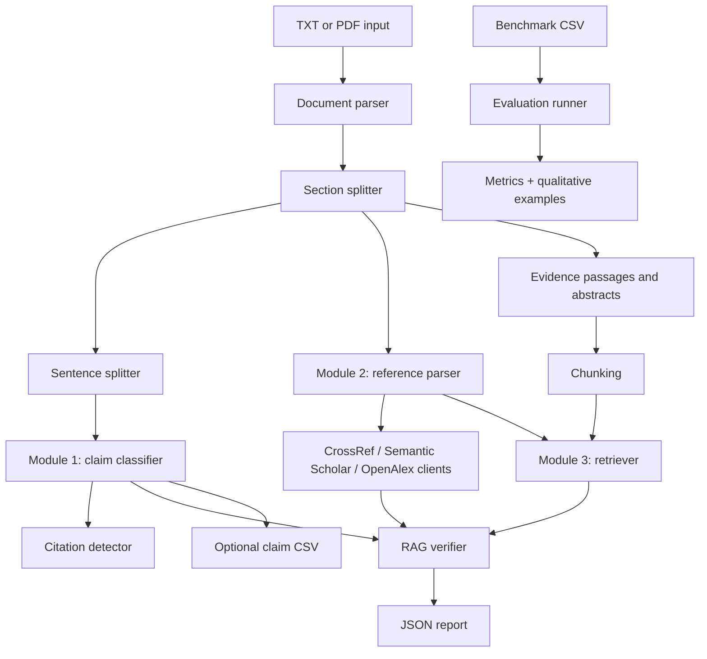

# ClaimGuard

ClaimGuard is an offline-first Python application for checking citation integrity in academic drafts. It was built for a Deep Learning Capstone Project and implements three working modules:

1. Claim and citation detection.
2. Reference extraction and validation.
3. RAG-style claim-source verification.

The project runs without API keys or network access on the included sample files. Optional APIs and local embedding models can improve reference validation and evidence retrieval when available.

## Quick Start

Run these commands from inside `CapStone Project/`.

Windows PowerShell:

```powershell
python -m venv .venv
.\.venv\Scripts\activate
python -m pip install --upgrade pip
python -m pip install -r requirements.txt
```

macOS or Linux:

```bash
python3 -m venv .venv
source .venv/bin/activate
python -m pip install --upgrade pip
python -m pip install -r requirements.txt
```

Optional local embedding retrieval:

```bash
python -m pip install ".[rag]"
```

FAISS wheels are platform-dependent. If FAISS or `sentence-transformers` is unavailable, ClaimGuard falls back to deterministic lexical retrieval and remains runnable offline.

## Commands

Analyze one of the existing PDF reports:

```bash
python run_claimguard.py --input "Reports/NW2_RQ1_Report.pdf" --output outputs/report_analysis.json
```

Analyze the intentionally problematic sample:

```bash
python run_claimguard.py --input data/sample_input/sample_bad_paper.txt --output outputs/bad_sample_analysis.json
```

Export Module 1 claim and citation rows as CSV:

```bash
python run_claimguard.py --input data/sample_input/sample_bad_paper.txt --output outputs/bad_sample_analysis.json --claims-csv outputs/bad_sample_claims.csv
```

Run the benchmark evaluation:

```bash
python run_evaluation.py --benchmark data/benchmark/claimguard_benchmark.csv --output outputs/evaluation_report.json
```

Run tests:

```bash
pytest
```

Enable online reference validation:

```powershell
copy .env.example .env
$env:CLAIMGUARD_ENABLE_APIS = "true"
python run_claimguard.py --input data/sample_input/sample_paper.txt --output outputs/sample_analysis.json --enable-apis
```

CLI options:

- `run_claimguard.py --input PATH --output PATH`: required document analysis command.
- `--claims-csv PATH`: optional Module 1 CSV export.
- `--enable-apis`: enables CrossRef, Semantic Scholar, and OpenAlex lookups.
- `--log-level LEVEL`: optional logging level, for example `INFO` or `DEBUG`.
- `run_evaluation.py --benchmark PATH --output PATH`: required benchmark evaluation command.

## Architecture



## Implemented Modules

### Module 1: Claims and Citations

- Parses `.txt` and `.pdf` documents.
- Splits text into sentences.
- Detects numeric citations such as `[1]`, `[1, 2]`, and `[3-5]`.
- Detects author-year citations such as `(Smith et al., 2023)`, grouped citations, and narrative citations such as `Smith et al. (2023)`.
- Classifies sentences as `factual_claim`, `methodological_statement`, `opinion_or_interpretation`, `background_or_definition`, or `non_claim`.
- Flags factual claims without citations.
- Exports a dedicated `module_1` JSON section and optional claim/citation CSV.

### Module 2: References

- Extracts references from a `References`, `Bibliography`, or `Works Cited` section.
- Handles wrapped APA-style entries, numbered entries, IEEE-like quoted titles, DOI strings, and DOI URLs.
- Parses reference index, title, authors, year, and DOI when possible.
- Uses robust fuzzy matching for title, year, DOI, and author comparisons.
- Optionally queries CrossRef, Semantic Scholar, and OpenAlex with bounded timeouts.
- Fails gracefully when APIs are disabled, unavailable, rate-limited, or return no match.
- Returns `verified`, `partially_matched`, `unverified`, `retracted_or_problematic`, or `api_unavailable`.

### Module 3: RAG Verification

- Builds evidence from sample evidence passages, parsed references, and optional API abstracts.
- Chunks evidence into overlapping sentence-aware passages.
- Retrieves top-k evidence with FAISS when available.
- Falls back to embedding cosine retrieval if embeddings are available but FAISS is not.
- Falls back to deterministic lexical retrieval when no embedding backend is installed.
- Labels cited claims as `supported`, `partially_supported`, `not_supported`, `contradicted`, or `insufficient_evidence`.
- Reports confidence, rationale, cited reference indices, evidence scores, retrieval method, and chunk IDs.

## Output Files

- `outputs/bad_sample_analysis.json`: full analysis for the intentionally problematic sample.
- `outputs/bad_sample_claims.csv`: optional Module 1 claim/citation table.
- `outputs/report_analysis.json`: analysis for one existing PDF report.
- `outputs/evaluation_report.json`: benchmark metrics, predictions, qualitative examples, and caveats.

## Example Result

Running:

```bash
python run_claimguard.py --input data/sample_input/sample_bad_paper.txt --output outputs/bad_sample_analysis.json
```

produces a summary like:

```json
{
  "sentences": 5,
  "factual_claims": 3,
  "claims_missing_citations": 1,
  "references": 2,
  "verified_claim_status_counts": {
    "contradicted": 2,
    "insufficient_evidence": 1
  }
}
```

Running:

```bash
python run_evaluation.py --benchmark data/benchmark/claimguard_benchmark.csv --output outputs/evaluation_report.json
```

currently evaluates 15 synthetic benchmark cases, with 3 examples per verifier label. The generated report includes accuracy, per-label precision/recall/F1, macro-F1, micro-F1, a confusion matrix, example predictions, and caveats. On the included benchmark, the current deterministic offline run reports accuracy `1.0` and macro-F1 `1.0`.

## Benchmark

The benchmark lives at `data/benchmark/claimguard_benchmark.csv`.

Columns:

- `case_id`: stable row identifier.
- `category`: broad test category.
- `claim`: claim text to verify.
- `evidence`: source evidence snippet.
- `expected_label`: one of the five Module 3 labels.
- `notes`: human-readable annotation note.

This benchmark is intentionally small and synthetic. It is useful for regression testing and capstone demonstration, not for estimating real-world scientific accuracy.

## Optional APIs

ClaimGuard runs offline by default. To enable APIs, copy `.env.example` to `.env` or set environment variables directly.

Supported variables:

- `CLAIMGUARD_ENABLE_APIS=true`
- `CROSSREF_MAILTO=your-email@example.com`
- `SEMANTIC_SCHOLAR_API_KEY=...`
- `OPENALEX_MAILTO=your-email@example.com`
- `CLAIMGUARD_USE_EMBEDDINGS=auto`
- `CLAIMGUARD_EMBEDDING_MODEL=sentence-transformers/all-MiniLM-L6-v2`

No secrets are hardcoded. API failures are logged and converted into graceful validation statuses.

## Reproducibility Checklist

1. Create and activate a virtual environment.
2. Install `requirements.txt`.
3. Run the bad sample analysis command.
4. Run the evaluation command.
5. Inspect `outputs/bad_sample_analysis.json` and `outputs/evaluation_report.json`.
6. Run `pytest` to execute the test suite.

The offline outputs are deterministic for the included sample data. Optional API calls and optional embedding retrieval can change validation metadata, retrieval scores, and sometimes labels.

## Limitations

- Claim detection is heuristic and sentence-level; it does not understand full discourse structure.
- Citation detection covers common academic patterns but is not a complete citation parser.
- PDF extraction depends on available libraries; the built-in fallback is intentionally minimal.
- Offline reference validation cannot prove that a source exists.
- API validation depends on external availability, metadata quality, rate limits, and search ranking.
- RAG verification uses snippets, abstracts, reference text, and sample evidence rather than full papers unless full source text is provided.
- Confidence scores are heuristic calibration signals, not probabilities.
- The included benchmark is synthetic and small, so high scores should be interpreted as a regression-test result, not evidence of deployment-ready performance.

## Ethics

ClaimGuard is a triage and teaching tool. It can help identify missing citations, questionable references, and source-support risks, but it should not be used as an automatic misconduct detector or grading authority.

Human review is required before making academic integrity judgments, accusations, publication decisions, or grade decisions. The tool can be wrong because scholarly claims are contextual, citations may support only part of a sentence, and source quality cannot be fully assessed from metadata or short evidence snippets.

