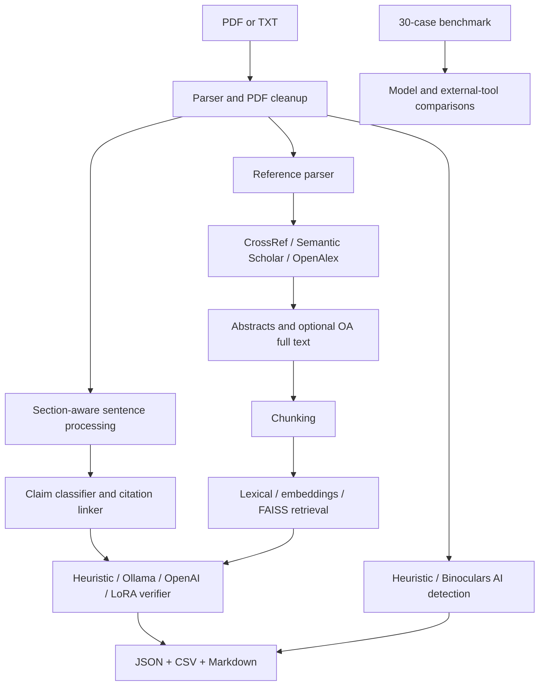

# ClaimGuard

ClaimGuard is an end-to-end academic writing integrity checker built for the MWI Deep
Learning Capstone Project. It accepts PDF or plain-text documents and produces both a
machine-readable JSON report and an optional concise Markdown review.

The application contains all three core modules, completed optional Modules 4 and 5, and a
reusable (but not empirically completed) Module-6 comparison scaffold:

1. Claim extraction, citation linking, citation-needed severity, and section awareness.
2. Bibliographic extraction and validation through CrossRef, Semantic Scholar, and OpenAlex.
3. RAG evidence retrieval plus heuristic, Ollama, OpenAI, or SciFact-LoRA verification.
4. Optional AI-generated-text detection through evaluated Fast-DetectGPT integration; Binoculars
   is integrated but its calibrated 14B pair exceeds the available 8 GB GPU.
5. Optional LoRA fine-tuning on SciFact.
6. Shared benchmark import/comparison for external tools; no completed scite/SemanticCite run is
   claimed.

All optional network and model features are opt-in. The base application remains deterministic
and runnable offline.

## Repository layout

- `apps/`: interactive Streamlit application.
- `claimguard/`: reusable parsing, validation, retrieval, verification, and reporting package.
- `scripts/`: CLI entry points, training jobs, and reproducible evaluation runners.
- `data/`: sample inputs, benchmark datasets, source reports, and pinned benchmark provenance.
- `outputs/evaluation/`: reportable metrics and comparison artifacts.
- `outputs/examples/`: example document analyses.
- `outputs/models/`: the selected deployable LoRA adapter only.
- `docs/report/`: LaTeX report source and compiled PDF.
- `docs/presentation/`: final German deck/PDF with source, notes, and media in subdirectories.

## Interactive frontend

ClaimGuard includes a German Streamlit interface for uploads, pasted text, sample documents,
claim-by-claim evidence review, cautious result interpretation, automatic side-by-side verifier
comparison, and JSON export. Install and start it from inside `CapStone Project/`:

```powershell
python -m pip install -e ".[ui]"
streamlit run apps/streamlit_app.py
```

The default heuristic mode runs locally and is recommended for a quick demonstration. Ollama,
OpenAI, SciFact-LoRA, scholarly APIs, and AI-text detection can be selected in the sidebar when
their respective dependencies and environment variables are configured. Confidence values in
the interface are explicitly presented as model signals, not correctness probabilities.
The `Modellvergleich` tab can run two or more verifier backends on the same document and highlights
agreements, disagreements, latency, and backend errors. OpenAI comparison requires an explicit
cost confirmation in the interface.

## 1. Base installation

Run from inside `CapStone Project/`:

```powershell
python -m venv .venv
.\.venv\Scripts\Activate.ps1
python -m pip install --upgrade pip
python -m pip install -r requirements.txt
copy .env.example .env
```

Dependency profiles are deliberately separated:

- `requirements.txt`: small, CPU-only base application.
- `requirements-rag.txt`: NumPy and Sentence Transformers.
- `requirements-lora.txt`: RAG plus Torch, Datasets, PEFT, and Accelerate.
- `requirements-binoculars.txt`: official Binoculars integration and its model stack.
- `requirements-torch-cuda.txt`: pinned CUDA 12.8 Torch wheel for this Windows/NVIDIA setup.

Keeping the large model stacks out of the base requirements makes installation and grading more
reliable, especially on Windows.

The application now loads `.env` automatically. Never commit `.env`; it is ignored by Git.

## 2. Basic offline analysis

```powershell
python -m scripts.run_claimguard `
  --input data/sample_input/sample_bad_paper.txt `
  --output outputs/examples/sample_analysis.json `
  --claims-csv outputs/examples/sample_claims.csv `
  --markdown-output outputs/examples/sample_report.md
```

Analyze an RQ report:

```powershell
python -m scripts.run_claimguard `
  --input "data/reports/NW2_RQ1_Report.pdf" `
  --output outputs/examples/rq1_analysis.json `
  --markdown-output outputs/examples/rq1_report.md
```

The Markdown report is intended for humans. The larger JSON preserves every prediction,
evidence chunk, confidence score, backend name, and API result for evaluation.

## 3. Scholarly APIs and full-text retrieval

Edit `.env`:

```dotenv
CLAIMGUARD_ENABLE_APIS=true
CROSSREF_MAILTO=your-real-email@example.com
OPENALEX_MAILTO=your-real-email@example.com
SEMANTIC_SCHOLAR_API_KEY=
UNPAYWALL_EMAIL=your-real-email@example.com
CLAIMGUARD_FETCH_FULL_TEXT=false
```

CrossRef and OpenAlex do not require API keys for normal polite use. A Semantic Scholar key is
optional but useful for rate limits. Enable bounded open-access PDF retrieval explicitly:

```powershell
python -m scripts.run_claimguard `
  --input "data/reports/NW2_RQ1_Report.pdf" `
  --output outputs/examples/rq1_api_analysis.json `
  --enable-apis `
  --fetch-full-text
```

The downloader accepts only HTTP(S) PDFs, limits downloads to 20 MB each, and fetches at most
three sources by default. Change `CLAIMGUARD_MAX_FULL_TEXT_SOURCES` if needed.

## 4. Embedding retrieval

Install the optional RAG dependencies:

```powershell
python -m pip install -r requirements-rag.txt
```

For the first model download, set:

```dotenv
CLAIMGUARD_USE_EMBEDDINGS=true
CLAIMGUARD_EMBEDDING_LOCAL_ONLY=false
CLAIMGUARD_EMBEDDING_MODEL=sentence-transformers/all-MiniLM-L6-v2
```

After the model is cached, switch `CLAIMGUARD_EMBEDDING_LOCAL_ONLY=true` for reproducible
offline runs. ClaimGuard uses FAISS when available, embedding cosine similarity otherwise, and
deterministic lexical retrieval as the final fallback.

## 5. Claim verification backends

Every backend receives the same retrieved evidence and returns the same five labels:

- `supported`
- `partially_supported`
- `not_supported`
- `contradicted`
- `insufficient_evidence`

### Heuristic baseline

```powershell
python -m scripts.run_claimguard --input data/sample_input/sample_bad_paper.txt --output outputs/examples/heuristic.json --verifier heuristic
```

This is the transparent offline baseline based on lexical coverage, negation, direction, and
explicit absence-of-evidence cues.

### Local Ollama model

Install Ollama separately, then:

```powershell
ollama pull qwen3:1.7b
ollama serve
```

Configure and run:

```dotenv
OLLAMA_BASE_URL=http://localhost:11434
OLLAMA_MODEL=qwen3:1.7b
```

```powershell
python -m scripts.run_claimguard --input data/sample_input/sample_bad_paper.txt --output outputs/examples/ollama.json --verifier ollama
```

### OpenAI frontier model

ChatGPT subscriptions and API billing are separate. ChatGPT Plus does not automatically provide
API credits. Create an API project/key and configure API billing at
https://platform.openai.com/, then put the key only in your local `.env`:

```dotenv
OPENAI_API_KEY=your-key
OPENAI_MODEL=gpt-5.4-mini
# Optional when you need explicit dashboard attribution:
OPENAI_PROJECT_ID=
OPENAI_ORGANIZATION_ID=
```

Run:

```powershell
python -m scripts.run_claimguard --input data/sample_input/sample_bad_paper.txt --output outputs/examples/openai.json --verifier openai
```

The implementation uses the OpenAI Responses API with a strict JSON schema and `store=false`.
API calls cost money. Keep benchmark inputs small and inspect usage in each verification's
metadata.

Run one minimal, sanitized connection and dashboard-attribution check:

```powershell
python -m scripts.run_openai_diagnostic
```

The output shows the OpenAI response ID, request ID, model, project/organization attribution,
and token usage without printing the API key. In the OpenAI Usage Dashboard, select the same
organization, clear the project selector to show all projects, and remember that dashboard time
ranges use UTC.

### SciFact LoRA adapter

After training Module 5, configure:

```dotenv
CLAIMGUARD_LORA_MODEL=outputs/models/scifact-lora
```

```powershell
python -m scripts.run_claimguard --input data/sample_input/sample_bad_paper.txt --output outputs/examples/lora.json --verifier lora
```

## 6. Optional Module 4: AI-generated-text detection

The lightweight heuristic is useful only as a baseline:

```powershell
python -m scripts.run_ai_detection `
  --input "data/reports/NW2_RQ1_Report.pdf" `
  --output outputs/examples/ai_heuristic.json `
  --method heuristic
```

Install and run the ICML 2024 Binoculars integration:

```powershell
py -3.10 -m venv .venv-binoculars
.\.venv-binoculars\Scripts\python.exe -m pip install -r requirements-binoculars.txt
.\.venv-binoculars\Scripts\python.exe -m scripts.run_ai_detection `
  --input "data/reports/NW2_RQ1_Report.pdf" `
  --output outputs/examples/ai_binoculars.json `
  --method binoculars
```

The separate environment is intentional: the official implementation pins Transformers 4.31
and was tested with Python 3.9, whereas the main project uses a current Transformers release.
Its calibrated pair is `tiiuae/falcon-7b` plus `tiiuae/falcon-7b-instruct` (roughly 14 billion
parameters in total). It does not fit into an 8 GB RTX 3070 Ti; use a substantially larger GPU
or enough system RAM for CPU inference. A smaller custom pair changes the score distribution
and invalidates the published threshold unless it is recalibrated. AI-detection output is not
proof of authorship and must never be used as an automatic misconduct decision.

Alternatively, configure the official Fast-DetectGPT API (one paid/credited request per scored
paragraph):

```dotenv
FASTDETECT_API_KEY=your-key
FASTDETECT_API_ENDPOINT=https://api.fastdetect.net/api/detect
FASTDETECT_MODEL=fast-detect(llama3-8b/llama3-8b-instruct)
FASTDETECT_THRESHOLD=0.5
```

```powershell
python -m scripts.run_ai_detection `
  --input "data/reports/NW2_RQ1_Report.pdf" `
  --output outputs/examples/ai_fast_detect_gpt.json `
  --method fast_detect_gpt
```

The included reproducible benchmark is generated from the paired original/GPT-4 PubMed passages
in the official Fast-DetectGPT repository (pinned commit `971b052`, seed 42):

```powershell
python -m scripts.prepare_fastdetect_benchmark `
  --input data/cache/fast-detect-gpt-official/exp_gpt3to4/data/pubmed_gpt-4.raw_data.json `
  --output data/benchmark/ai_detection_benchmark.csv `
  --pairs 15 `
  --seed 42
```

Run or resume the API evaluation with:

```powershell
python -m scripts.run_ai_detection_evaluation `
  --benchmark data/benchmark/ai_detection_benchmark.csv `
  --output outputs/evaluation/fast_detect_gpt.json `
  --method fast_detect_gpt `
  --retries 3
```

The evaluator reports coverage, Accuracy, Precision, Recall, F1, AUROC, latency, and descriptive
citation-count differences. The completed 30-passage run achieved Accuracy 0.767, Precision 1.000,
Recall 0.533, F1 0.696, and AUROC 0.924 at 1,018.8 ms mean API latency. It made no false-positive
human flags but missed 7/15 generated passages. The official benchmark has no citation markers,
so no detector--citation association is claimed. Reports with unknown or mixed authorship are not
valid ground truth, and private report text should not be sent to an external detector without
explicit consent.

## 7. Optional Module 5: SciFact LoRA training

Install training dependencies:

```powershell
python -m pip install -r requirements-torch-cuda.txt
python -m pip install -r requirements-lora.txt
```

Train and evaluate the completed DistilBERT sequence classifier with LoRA:

```powershell
python -m scripts.train_scifact_lora `
  --base-model distilbert-base-uncased `
  --output outputs/models/scifact-lora `
  --epochs 3 `
  --batch-size 8 `
  --gradient-accumulation 2
```

The script downloads the official `allenai/scifact` claims and corpus configurations, joins
claims to evidence abstracts, trains only LoRA adapters, evaluates Accuracy and Macro-F1, and
writes `training_report.json`. SciFact is CC BY-NC 2.0; review its license before use.

The completed adapter in this workspace is `outputs/models/scifact-lora`, trained from
`distilbert-base-uncased` on 1,261 training and 450 validation pairs. It reached 0.409 validation
Accuracy and 0.353 Macro-F1. See `docs/FINAL_RESULTS.md` for transfer results and caveats.

Compare the trained adapter against temperature-zero Ollama prompting and a majority baseline on
the same deterministic, balanced SciFact subset (30 cases per native label):

```powershell
ollama serve
python -m scripts.run_scifact_model_comparison `
  --archive data/cache/scifact-data.tar.gz `
  --adapter outputs/models/scifact-lora `
  --per-label 30 `
  --seed 42 `
  --output outputs/evaluation/scifact_lora_vs_zeroshot.json
```

Measured on these 90 pairs: majority Accuracy/Macro-F1 `0.333/0.167`, LoRA
`0.389/0.367`, and Ollama `qwen3:1.7b` zero-shot `0.533/0.433`. LoRA therefore improved
over the trivial baseline but not over zero-shot prompting; it was the only compared model to
recover the CONTRADICT class meaningfully (F1 `0.360`, versus Ollama `0.000`).

Training requires model downloads and substantially more compute than the base project. If GPU
memory is limited, reduce batch size or choose a smaller compatible encoder and adjust
`--target-modules`. The default `auto` setting detects the attention query/value projections
without wrapping the classification head. For a
quick real smoke run on the cached smaller model, add `--base-model distilbert-base-uncased
--max-train-samples 200 --max-eval-samples 100 --epochs 1`.

## 8. Evaluation and model comparison

Evaluate Module 1 claim types and citation-needed flags separately:

```powershell
python -m scripts.run_claim_evaluation `
  --benchmark data/benchmark/rq_claim_annotations.csv `
  --output outputs/evaluation/rq_claim_evaluation.json
```

Evaluate Module 2 reference-field extraction offline:

```powershell
python -m scripts.run_reference_evaluation `
  --benchmark data/benchmark/reference_parsing_benchmark.csv `
  --output outputs/evaluation/reference_evaluation.json
```

Run the 30-reference gold benchmark (20 authentic report references and 10 controlled
perturbations) against the configured scholarly APIs:

```powershell
python -m scripts.run_bibliographic_validation_evaluation `
  --benchmark data/benchmark/module2_validation_benchmark.csv `
  --output outputs/evaluation/module2_validation.json `
  --timeout 10 `
  --delay 0.75
```

This evaluates single-record parsing, final bibliographic status, exists/not-found, DOI
resolution, and retraction flags. Public API rate limiting is recorded per case; do not interpret
an API-degraded run as an availability-independent model score.

The included benchmark now contains 30 labeled examples, six for each verification label:

```powershell
python -m scripts.run_evaluation `
  --benchmark data/benchmark/claimguard_benchmark.csv `
  --output outputs/evaluation/evaluation_lexical.json `
  --verifier heuristic
```

Compare baseline, local, and frontier models on exactly the same cases:

```powershell
python -m scripts.run_model_comparison `
  --benchmark data/benchmark/claimguard_benchmark.csv `
  --output outputs/evaluation/model_comparison_full.json `
  --markdown-output outputs/evaluation/model_comparison_full.md `
  --verifiers heuristic,ollama,openai,lora
```

The report includes per-label Precision/Recall/F1, Macro-F1, Micro-F1, confusion matrices,
latency, qualitative examples, and backend errors. The current offline heuristic result is
approximately 0.90 Accuracy and 0.90 Macro-F1. The dataset is still a teaching benchmark, not a
deployment-quality estimate.

Run the internal OpenAI no-retrieval ablation separately:

```powershell
python -m scripts.run_no_rag_baseline `
  --benchmark data/benchmark/claimguard_benchmark.csv `
  --output outputs/evaluation/openai_no_rag_baseline.json `
  --retries 2
```

The runner checkpoints each completed case and resumes after transient failures. It must finish
all 30 cases before its metrics are cited. This is an internal ablation, not an existing-tool
benchmark, because the gold labels describe claim--evidence relations while no evidence is given.

The real-RQ annotation file contains 50 manually reviewed sentences, ten from each RQ report.
It is deliberately kept separate from the synthetic regression benchmark. Current measured
results and the exact experimental status are summarized in `docs/FINAL_RESULTS.md`.

The mapping from report tables to saved artifacts and exact commands is in
`outputs/evaluation/README.md`.

Build the report twice so references and page labels settle:

```powershell
Set-Location docs/report
pdflatex -interaction=nonstopmode -halt-on-error ClaimGuard_Technical_Report.tex
pdflatex -interaction=nonstopmode -halt-on-error ClaimGuard_Technical_Report.tex
Set-Location ../..
```

The main-text page count ends at the `mainend` label; references and the appendix follow it.

## 9. Optional Module 6: comparison with existing tools

Run the benchmark through an existing tool such as Scite or SemanticCite. Record one row per
case using `data/benchmark/external_tool_predictions_template.csv` and the columns
`case_id,predicted,notes`.

Then compare all exported predictions:

```powershell
python -m scripts.run_tool_comparison `
  --benchmark data/benchmark/claimguard_benchmark.csv `
  --tool ClaimGuard=outputs/evaluation/evaluation_lexical.json `
  --tool ExistingTool=data/benchmark/existing_tool_predictions.csv `
  --output outputs/evaluation/tool_comparison.json
```

This produces a shared leaderboard, coverage, Accuracy, Macro/Micro-F1, per-label metrics, and
error lists. External tools often require manual use or their own accounts; ClaimGuard therefore
uses an explicit prediction import rather than pretending to automate an unavailable API.

## 10. Tests

```powershell
pytest
```

The suite covers citation formats, section-aware classification, severity/context linking,
reference parsing and venue extraction, fuzzy matching, RAG retrieval, shared model output
schemas, AI-detection safeguards, evaluation, tool comparison, Markdown output, and full-pipeline
smoke tests.

Report, presentation, and human-annotation checklists live in `docs/`. The local/frontier
comparison is complete; the external-tool and no-RAG comparisons remain incomplete and must not
be claimed until their output files contain full runs.

## Architecture



## Limitations and ethics

- PDF extraction is never perfect, especially for scanned or multi-column documents.
- The baseline claim classifier is heuristic; methods and original results can still be
  misclassified.
- Bibliographic API matches depend on metadata quality and service availability.
- Abstracts may not contain enough information to verify detailed claims.
- LLM verifier outputs are nondeterministic and can be wrong.
- AI-generated-text detection is unreliable for edited, paraphrased, short, and non-English text.
- Confidence values are calibration signals, not probabilities of misconduct.
- Human review is mandatory before grading, publication, or integrity decisions.
