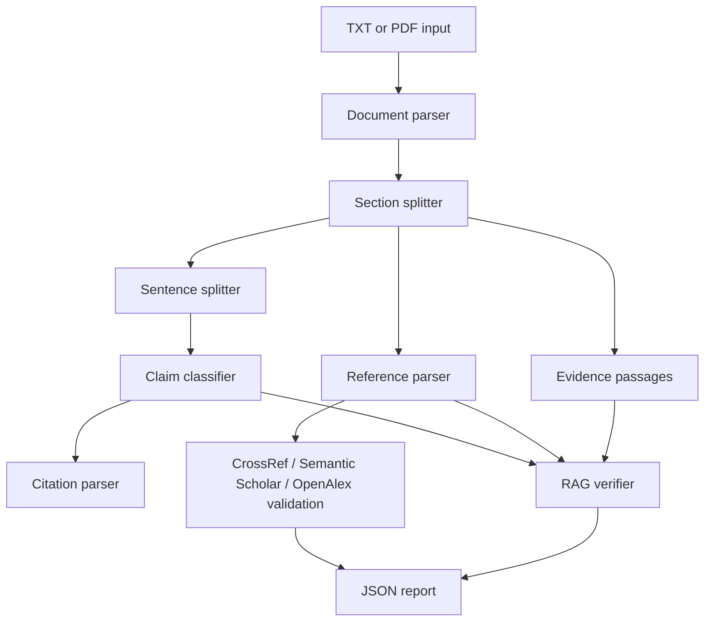

# ClaimGuard

ClaimGuard is a runnable Python application for checking citation integrity in academic drafts. It was built for a Deep Learning Capstone Project and implements a compact, offline-first version of three modules:

1. Claim and citation detection.
2. Reference validation with optional scholarly APIs.
3. RAG-style claim-source support checking.

The app works without API keys on the sample data in `data/sample_input/`. Optional APIs and embedding backends improve matching when available.

## Installation

From inside `Capstone Project/`:

```bash
python -m venv .venv
.venv\Scripts\activate
pip install -r requirements.txt
```

Optional RAG dependencies:

```bash
pip install ".[rag]"
```

FAISS wheels are platform-dependent. If FAISS is not available, ClaimGuard automatically falls back to an offline token retriever.

## Usage

Analyze one of the existing PDF reports:

```bash
python run_claimguard.py --input "Reports/NW2_RQ1_Report.pdf" --output outputs/report_analysis.json
```

Analyze the intentionally problematic sample:

```bash
python run_claimguard.py --input data/sample_input/sample_bad_paper.txt --output outputs/bad_sample_analysis.json
```

Export Module 1 claim/citation rows as CSV:

```bash
python run_claimguard.py --input data/sample_input/sample_bad_paper.txt --output outputs/bad_sample_analysis.json --claims-csv outputs/bad_sample_claims.csv
```

Run the benchmark:

```bash
python run_evaluation.py --benchmark data/benchmark/claimguard_benchmark.csv --output outputs/evaluation_report.json
```

Enable online validation:

```bash
set CLAIMGUARD_ENABLE_APIS=true
python run_claimguard.py --input data/sample_input/sample_paper.txt --output outputs/sample_analysis.json --enable-apis
```

Copy `.env.example` to `.env` if you want to store local environment settings. No secrets are hardcoded.

## Architecture



## Modules Implemented

**Module 1: claim and citation detection**

- Parses `.txt` and `.pdf` input.
- Splits main text into sentences.
- Detects `(Smith et al., 2023)` and `[1]` style citations.
- Classifies sentences as `factual_claim`, `methodological_statement`, `opinion_or_interpretation`, `background_or_definition`, or `non_claim`.
- Flags factual claims without citations.

**Module 2: reference validation**

- Extracts references from a `References` section.
- Parses index, title, authors, year, and DOI where possible.
- Uses fuzzy matching for title and metadata comparison.
- Can query CrossRef, Semantic Scholar, and OpenAlex when enabled.
- Produces `verified`, `partially_matched`, `unverified`, `retracted_or_problematic`, or `api_unavailable`.
- Handles API failures by logging a warning and continuing.

**Module 3: RAG-style support checking**

- Builds an evidence index from sample evidence passages and parsed references.
- Uses `sentence-transformers` plus FAISS when installed and locally cached.
- Falls back to an offline token retriever.
- Labels cited claims as `supported`, `partially_supported`, `not_supported`, `contradicted`, or `insufficient_evidence`.
- Includes confidence scores and evidence passages in the JSON report.

## Example Output

```json
{
  "summary": {
    "sentences": 5,
    "factual_claims": 3,
    "claims_missing_citations": 1,
    "references": 2,
    "verified_claim_status_counts": {
      "contradicted": 2,
      "insufficient_evidence": 1
    }
  }
}
```

Each `claim_verification` item includes the claim index, support label, confidence, cited reference indices, rationale, and retrieved evidence passages.

## Evaluation

The benchmark file is `data/benchmark/claimguard_benchmark.csv`. It contains short claim/evidence pairs with expected labels. The evaluator reports accuracy, a confusion matrix, per-row predictions, confidence, and evidence snippets.

Run tests:

```bash
pytest
```

## Limitations

- Claim classification is heuristic and sentence-level; it does not perform deep discourse analysis.
- Offline reference validation cannot confirm that a paper exists.
- API matching depends on availability, rate limits, and metadata quality.
- The RAG verifier uses abstracts, parsed references, and sample evidence unless full source text is supplied.
- Contradiction detection is intentionally simple and should be treated as a triage signal, not a final judgment.

## Ethics

ClaimGuard is designed to help students and reviewers find citation risks. It should not be used as an automatic misconduct detector. Human review is required before making academic integrity judgments, grading decisions, or accusations. The tool reports uncertainty through confidence scores and explicit rationales.

## Reproducibility Notes

- The sample inputs and benchmark are stored in this repository.
- Offline runs do not require API keys or network access.
- Optional APIs are controlled by `CLAIMGUARD_ENABLE_APIS` and `--enable-apis`.
- Optional embedding retrieval requests local model files only; it does not download models during analysis.
- JSON reports are written to `outputs/`.
